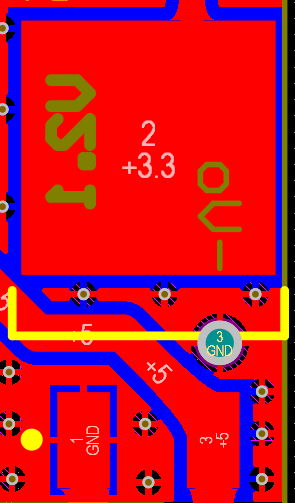
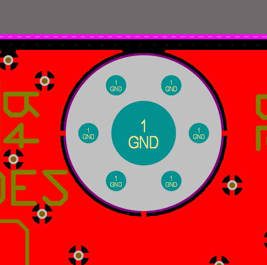

# 水下机器人隔离电源模块

使用*HLK-10D1205B*隔离电源模块和*AIC1084*LDO搭建

**输入：9V~18V**

**输出：5V、3.3V**

**输入输出之间地线隔离**

* Vertical：自定义接口的垂直插入型模块
* Horizental：使用铜柱或其它固定件接入的叠层型模块

## 待改进的问题

Horizental的其中一个隔离电源模块的引脚3位于AIC1084引脚3的正下方，如果紧贴pcb安装可能会导致两个引脚接触，进而引起模块工作不正常乃至烧毁，在以后的版本中可能会调整布局来改善这个问题

此外，Horizental和Vertical的压敏电阻必须使用阻值大于20kΩ的，推荐使用33.3kΩ压敏电阻，否则有可能导致空载时隔离电源模块短路

## 已解决Bug

由于个人疏忽，旧版本输出端GND焊盘处存在严重bug

> 铺铜到焊盘走线过窄

现已进行修正

> 更改为1mm宽度

